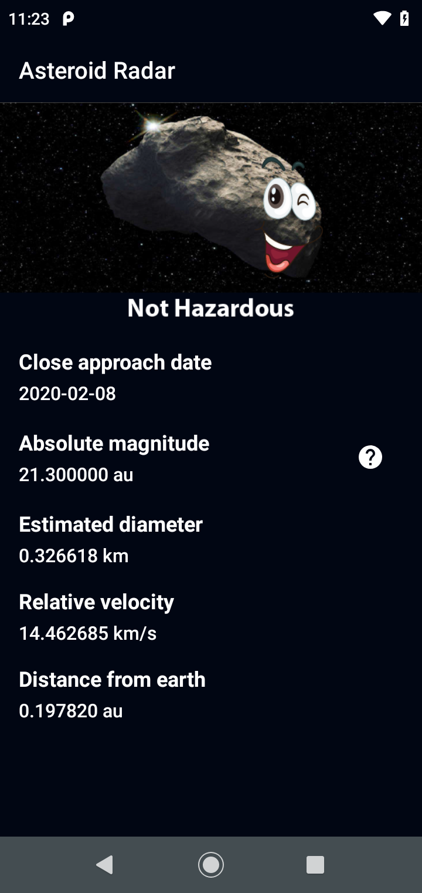
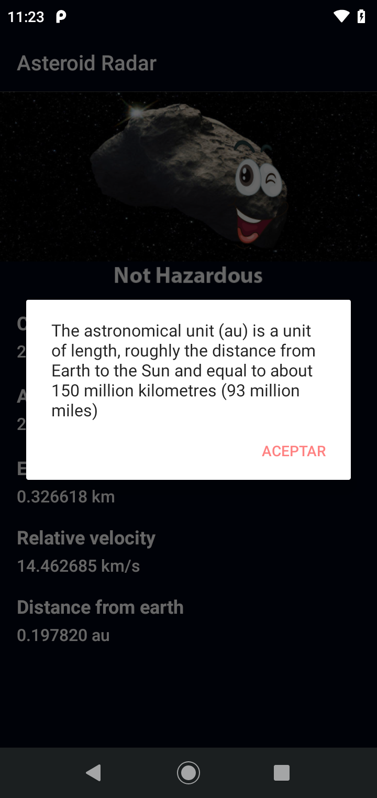

# Project Title

Asteroid Radar

## Getting Started

Asteroid Radar is an app to view the asteroids detected by NASA that pass near Earth, you can view all the detected asteroids in a period of time, their data (Size, velocity, distance to Earth) and if they are potentially hazardous.

The app is consists of two screens: A Main screen with a list of all the detected asteroids and a Details screen that is going to display the data of that asteroid once it´s selected in the Main screen list. The main screen will also show the NASA image of the day to make the app more striking.

This kind of app is one of the most usual in the real world, what you will learn by doing this are some of the most fundamental skills you need to know to work as a professional Android developer, as fetching data from the internet, saving data to a database, and display the data in a clear, clear, compelling UI.

### Screenshots





### Dependencies

```

    implementation 'androidx.core:core-ktx:1.7.0'
    implementation 'androidx.appcompat:appcompat:1.5.0'
    implementation 'com.google.android.material:material:1.6.1'
    implementation 'androidx.constraintlayout:constraintlayout:2.1.4'
    implementation 'androidx.navigation:navigation-fragment-ktx:2.5.1'
    implementation 'androidx.navigation:navigation-ui-ktx:2.5.1'
    testImplementation 'junit:junit:4.13.2'
    androidTestImplementation 'androidx.test.ext:junit:1.1.3'
    androidTestImplementation 'androidx.test.espresso:espresso-core:3.4.0'

    //retrofit
    implementation "com.squareup.retrofit2:retrofit:2.6.2"
    implementation "com.squareup.retrofit2:converter-moshi:2.5.0"
    implementation "com.squareup.moshi:moshi:1.8.0"
    implementation "com.squareup.moshi:moshi-kotlin:1.8.0"

    // Coroutines
    implementation "org.jetbrains.kotlinx:kotlinx-coroutines-core:1.6.4"
    implementation "org.jetbrains.kotlinx:kotlinx-coroutines-android:1.6.4"
    implementation "androidx.lifecycle:lifecycle-viewmodel-ktx:2.5.1"
    // Retrofit Coroutines Support
    implementation "com.jakewharton.retrofit:retrofit2-kotlin-coroutines-adapter:0.9.2"

    // Room database
    def room_version = "2.4.3"
    implementation "androidx.room:room-ktx:$room_version"
    implementation "androidx.room:room-runtime:$room_version"
    kapt "androidx.room:room-compiler:$room_version"

    //LifeCycle
    implementation 'androidx.lifecycle:lifecycle-common:2.5.1'
    implementation 'androidx.lifecycle:lifecycle-runtime:2.5.1'
    implementation 'androidx.lifecycle:lifecycle-livedata-ktx:2.5.1'

    //Work Manager
    def work_version = "2.7.1"
    implementation "androidx.work:work-runtime-ktx:$work_version"

    //Glide
    implementation 'com.github.bumptech.glide:glide:4.12.0'
    annotationProcessor 'com.github.bumptech.glide:compiler:4.12.0'

    //Recycler View
    implementation "androidx.recyclerview:recyclerview:1.2.1"

```

### Installation

To get the project running on your local machine, you need to follow these steps:

**Step 1: Clone the repo**

Use this to clone it to your local machine:
```bash
git clone https://github.com/RedBiscuits/MCIT-egFWD-Project2-AsteroidRadar.git
```

**Step 2: Check out the ‘master’ branch**

This branch is going to let you start working with it. The command to check out a branch would be:

```bash
git checkout master
```

**Step 3: Add your API key from NASA**

Open the project in Android Studio and your key at ui.utils.CONSTANTS.

**Step 4: Run the project and check that it compiles correctly**

Open the project in Android Studio and click the Run ‘app’ button, check that it runs correctly and you can see the app in your device or emulator.

## Testing

Explain the steps needed to run any automated tests

### Break Down Tests

Explain what each test does and why

```
Examples here
```

## Built With

To build this project you are going to use the NASA NeoWS (Near Earth Object Web Service) API, which you can find here.
https://api.nasa.gov/

You will need an API Key which is provided for you in that same link, just fill the fields in the form and click Signup.


